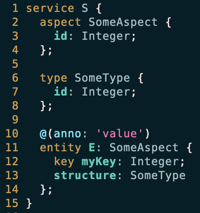

# tree-sitter-cds

## About this project

CAP CDS grammar for tree-sitter.

> Tree-sitter is a parser generator tool and an incremental parsing library.
> It can build a concrete syntax tree for a source file and efficiently update the
> syntax tree as the source file is edited. Tree-sitter aims to be:

 - https://tree-sitter.github.io/tree-sitter/

You can use tree-sitter-cds to highlight CAP CDS files in Neovim and
to query the concrete syntax tree of CDS files.

This project followed the instructions of the [tree-sitter guide].

## Documentation

Please refer to the `docs/` folder.  It contains:

- [Development](./docs/development.md)
- [Contributing](./CONTRIBUTING.md)
- [Neovim Support](./docs/neovim-support.md)
- [CDS Compiler Differences](./docs/cds-compiler-differences.md)

## Download and Installation

If you want to use tree-sitter-cds in Neovim for syntax highlighting,
please see [Neovim Support](./docs/neovim-support.md) for an
installation guide.

Documentation on NodeJs and Rust language bindings is work-in-progress.

## Requirements

If you want to use tree-sitter-cds in Neovim for syntax highlighting,
please see [Neovim Support](./docs/neovim-support.md) for requirements.

For local development setup, see [Development Docs](./docs/development.md).

## How to obtain support

This project is open to feature requests/suggestions, bug reports etc.
via [GitHub issues](https://github.com/cap-js-community/tree-sitter-cds/issues).

Contribution and feedback are encouraged and always welcome.
For more information about how to contribute, the project structure,
as well as additional contribution information, see our [Contribution Guidelines](CONTRIBUTING.md)
as well as our [development documentation](./docs/development.md).

## Features & Roadmap

This project contains a tree-sitter grammar for [CAP CDS](https://cap.cloud.sap/).

The main goal of this project it to provide syntax highlighting, e.g. for [Neovim](./docs/neovim-support.md).

It is _not_ a 100% CAP CDS compatible parser. There are places that this grammar
can't parse properly, yet.   There is also no error reporting by tree-sitter and
the syntax tree can change any time, as this project is not complete, yet.

In the future, we may try to add support for [stack-graphs by GitHub][stack-graphs].

## Code of Conduct

We as members, contributors, and leaders pledge to make participation in our community a harassment-free experience for everyone. By participating in this project, you agree to abide by its [Code of Conduct](CODE_OF_CONDUCT.md) at all times.

## Licensing

Copyright 2023 SAP SE or an SAP affiliate company and tree-sitter-cds contributors. Please see our [LICENSE](LICENSE) for copyright and license information. Detailed information including third-party components and their licensing/copyright information is available [via the REUSE tool](https://api.reuse.software/info/github.com/cap-js-community/<your-project>).

[tree-sitter guide]: https://tree-sitter.github.io/tree-sitter/creating-parsers
[stack-graphs]: https://github.blog/2021-12-09-introducing-stack-graphs/
